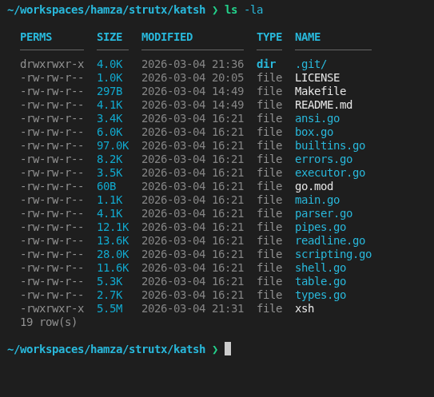

# StructSH — Structured Shell

> Everything is data. Every output is a table.

A Go shell where all command output is **structured** — parsed into typed rows and columns. Filter, transform, sort, and store results with a clean pipe syntax. All files are `package main` with zero external dependencies.




### Help
```sh
~/workspaces/hamza/strutx/katsh ❯ help

  
  
    ◈ StructSH — Structured Shell v0.2.0 ───�
  
    Every command output is a table. Chain transforms with | pipes.
    Store any result in the Box with #=.
  
    ── NAVIGATION ────────────────────────────────────────────
    cd [dir|-]          change directory (- for previous)
    pwd                 print working directory
    pushd <dir>         push dir onto stack and cd
    popd                pop stack and cd back
    dirs                show directory stack
  
    ── LISTING ────────────────────────────────────────────────
    ls [-la] [dir]      list files as table
    ll [dir]            ls -l shorthand
    la [dir]            ls -la shorthand
    tree [-L N] [dir]   visual directory tree
    du [-s] [dir]       disk usage per entry
    df                  filesystem usage
  
    ── FILE OPERATIONS ────────────────────────────────────────
    cat [-n] <file>     show file (optional line numbers)
    head [-n N] <file>  first N lines
    tail [-n N] <file>  last N lines
    touch <file...>     create/update files (shows table)
    mkdir [-p] <dir>    create directory
    rmdir <dir>         remove empty directory
    rm [-rf] <file>     remove files/dirs
    cp [-rv] <src> <dst> copy file or dir
    mv [-v] <src> <dst> move/rename
    ln [-s] <tgt> <lnk> create hard/soft link
  
    ── INSPECTION ─────────────────────────────────────────────
    wc [-lwc] <file>    word/line/byte count (table)
    stat <file...>      file metadata as table
    file <file...>      detect file type
    find [dir] [-name pattern] [-type f|d] [-maxdepth N] [-newer file]
    diff <file1> <file2> line-by-line diff as table
  
    ── TEXT PROCESSING ────────────────────────────────────────
    grep [-invr] <pat> <file>   regex search → table
    sed 's/old/new/[g]' <file>  substitution
    sed '/pat/d' <file>         delete matching lines
    awk [-F sep] '{print $N}' <file>  field extract → table
    cut -f N[-M] [-d sep] <file>      cut columns → table
    tr <set1> <set2> <file>     transliterate characters
    sort [-rnu] <file>          sort lines
    uniq [-c] <file>            remove/count duplicates
    split [-l N] <file> [prefix] split into chunks
    tee <src> <dst>             copy and show file
    xargs <cmd> <file>          run cmd per line in file
  
    ── PERMISSIONS ────────────────────────────────────────────
    chmod <mode> <file...>   set permissions (numeric or u+x style)
    chown <user> <file...>   change ownership (delegates to system)
  
    ── PROCESS ─────────────────────────────────────────────────
    ps [aux]              list processes (table)
    kill [-SIG] <pid...>  send signal
    sleep <seconds>       pause (max 60s)
    jobs                  show background jobs
  
    ── SYSTEM INFO ─────────────────────────────────────────────
    uname [-a]            OS and arch info
    uptime                system uptime
    date [+format]        current date/time (table or formatted)
    cal [month] [year]    calendar
    hostname [-i]         hostname and IP
    whoami                current user
    id                    uid/gid/groups table
    groups                group membership
    who / w               logged-in users
  
    ── NETWORK ─────────────────────────────────────────────────
    ping [-c N] <host>    ping (structured output)
    curl [-o file] <url>  HTTP request
    nslookup <host>       DNS lookup → table
    ifconfig / ip         network interfaces → table
  
    ── HASHING ─────────────────────────────────────────────────
    md5sum / sha1sum / sha256sum <file...>   hash files → table
  
    ── ARCHIVING (system) ──────────────────────────────────────
    tar, gzip, gunzip, zip, unzip  (delegated to system)
  
    ── TEXT GENERATION ────────────────────────────────────────
    echo [-ne] <text>     print text
    printf <fmt> [args]   formatted print
    yes [word]            repeat word (20 lines)
    seq [first [step]] last   number sequence → table
    base64 [-d] <file>    encode/decode base64
    rev <file>            reverse each line
  
    ── VARIABLES & ENVIRONMENT ────────────────────────────────
    set NAME=VAL          set session variable
    unset NAME            remove variable
    vars                  list session variables
    export NAME=VAL       set and export to OS env
    env / printenv        show environment variables
  
    ── IDENTIFICATION ──────────────────────────────────────────
    which <cmd>           find command (alias/builtin/path)
    type <cmd>            same as which
    alias name=cmd        define alias
    unalias name          remove alias
    aliases               list all aliases
  
    ── NUMERIC & MISC ──────────────────────────────────────────
    bc <expr>             calculate expression
    factor <n>            prime factorization
    random [max [min [count]]]  random numbers → table
  
    ── PIPE OPERATORS ─────────────────────────────────────────
    | select col1,col2    keep columns
    | where col=val       filter rows  (= != > < >= <= ~)
    | grep text           search all columns
    | sort col [asc|desc] sort rows
    | limit N             first N rows
    | skip N              skip N rows
    | count               count rows
    | unique [col]        deduplicate
    | reverse             flip order
    | fmt json|csv|tsv    reformat output
    | add col=value       add a column
    | rename old=new      rename a column
  
    ── BOX STORAGE ────────────────────────────────────────────
    cmd #=           auto-store result
    cmd #=key        store as named key
    box              list all entries
    box get <key>    retrieve entry
    box rm <key>     remove entry
    box rename o n   rename entry
    box tag k tag    add tag
    box search q     search
    box export f     export JSON
    box import f     import JSON
    box clear        wipe all
  
    ── SESSION ─────────────────────────────────────────────────
    history [N]      last N commands (table)
    source <file>    run script file
    watch [-n s] cmd run command repeatedly
    man <cmd>        manual page / description
    clear            clear screen
    help             this help
    true / false     exit 0 / exit 1
    exit / quit      leave StructSH

~/workspaces/hamza/strutx/katsh ❯ 
```

---

## Quick Start

```sh
git clone <repo>
cd structsh
go run .

# or build:
go build -o structsh .
./structsh
```

**Requires:** Go 1.22+, no external dependencies.

---

## File Layout

| File | Responsibility |
|---|---|
| `main.go` | Entry point only |
| `types.go` | Shared types: `Row`, `Result`, `BoxEntry`, `ParsedCommand`, `Alias` |
| `ansi.go` | ANSI color codes, prompt rendering |
| `table.go` | Aligned, color-coded table renderer |
| `box.go` | In-memory session store (Box) with tags, export/import |
| `parser.go` | Command line parser: pipes, `#=`, quotes, comments |
| `executor.go` | Runs OS commands, auto-parses output into tables |
| `pipes.go` | Pipe transforms: `select`, `where`, `sort`, `fmt`, etc. |
| `builtins.go` | Built-in commands: `cd`, `cat`, `find`, `alias`, `box`, etc. |
| `shell.go` | `Shell` struct, REPL loop, alias expansion, variable expansion |

---

## Syntax

### Basic command
```sh
ls -la
ps aux
env
df -h
```

### Pipe transforms (chainable)
```sh
ls -la | select name, size
ps aux | where cpu>5 | sort cpu desc | limit 10
env | grep PATH
ls | where type=dir | count
cat app.log | grep error | limit 20
env | fmt json
ps | select pid,command | fmt csv
```

### Where operators
| Operator | Meaning |
|---|---|
| `=` | exact match (case-insensitive) |
| `!=` | not equal |
| `>` `<` `>=` `<=` | numeric comparison |
| `~` | contains (substring) |

### Box storage
```sh
ls -la #=               # auto-name (out_1, out_2, ...)
ls -la #=myfiles        # named store

box                     # list all
box get myfiles         # retrieve by name
box get 3               # retrieve by id
box rm myfiles          # remove
box rename myfiles dirs # rename
box tag myfiles work    # tag
box filter tag work     # list by tag
box search go           # search name/source
box export snap.json    # export to JSON
box import snap.json    # import from JSON
box clear               # wipe all
```

### All pipe operators
| Pipe | Description |
|---|---|
| `\| select a,b,c` | keep only these columns |
| `\| where col=val` | filter rows |
| `\| grep text` | search all columns/lines |
| `\| sort col [asc\|desc]` | sort rows |
| `\| limit N` | keep first N rows |
| `\| skip N` | skip first N rows |
| `\| count` | count rows |
| `\| unique [col]` | deduplicate |
| `\| reverse` | flip row order |
| `\| fmt json\|csv\|tsv` | reformat output |
| `\| add col=value` | add a column |
| `\| rename old=new` | rename a column |

### Session variables
```sh
set MYVAR=hello
echo $MYVAR
unset MYVAR
vars           # show all session vars
```

### Aliases
```sh
alias ll=ls -la
alias lsd=ls -la | where type=dir
aliases        # list all
unalias ll
```

### Directory stack
```sh
pushd /tmp
popd
cd -           # go back to previous dir
```

### Other built-ins
```sh
cat file.txt
head -n 5 file.txt
tail -n 20 file.txt
wc file.txt            # lines/words/bytes as table
stat file.txt          # file metadata as table
which go               # find binary in PATH as table
find . -name *.go -type f
mkdir -p a/b/c
touch newfile.txt
cp src dst
mv old new
rm -rf dir/
history 20             # last 20 commands as table
```

---

## Example session

```
~ ❯ ls -la | where type=dir | select name, size
  NAME         SIZE
  ───────────  ──────
  projects/    4.0K
  .config/     4.0K
  2 row(s)

~ ❯ ps aux | where cpu>1 | sort cpu desc | limit 5 #=hotprocs
  📦 box["hotprocs"] id:1  5 rows

~ ❯ box get hotprocs
  ◈ box["hotprocs"] (id:1)  14:02:31
  $ ps aux

  PID    USER   CPU     MEM    COMMAND
  ─────  ─────  ──────  ─────  ──────────────────
  1102   user   45.3%   12.1%  go build ./...
  ...

~ ❯ env | grep GOPATH | fmt json
  [
    {"key": "GOPATH", "value": "/home/user/go"}
  ]
```
